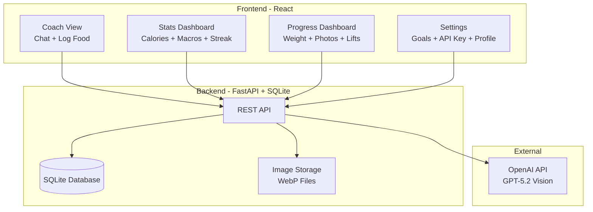
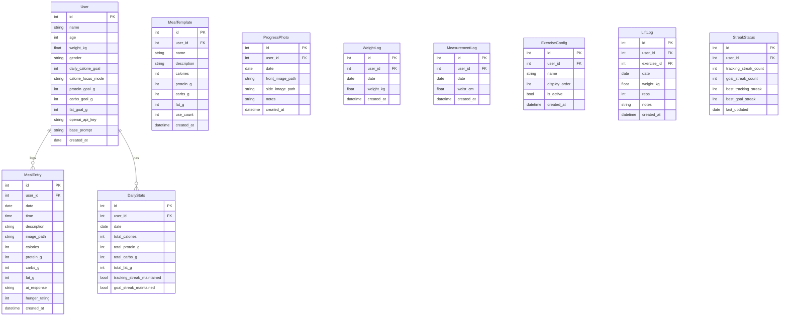

# Calorie Coach - MVP Build Plan

## Architecture Overview



## Tech Stack

| Layer | Technology | Rationale |

|-------|------------|-----------|

| Frontend | React + Vite | Fast, modern, great for responsive web apps |

| Styling | Tailwind CSS | Rapid styling, easy to create playful aesthetic |

| Backend | Python + FastAPI | Simple, fast, great for SQLite + API calls |

| Database | SQLite | Simple, no setup, perfect for personal use |

| AI | OpenAI GPT-5.2 | Vision capability for food photo analysis |

## Database Schema



## MVP Features (v1)

### 1. Coach View (Main Screen)

- Text input for describing food
- **Voice input** - speak what you ate, GPT-5.2 parses and estimates
- Image upload (camera or gallery)
- Send to GPT-5.2 for calorie/macro estimation
- **Protein Priority Display** - protein shown prominently alongside calories (color-coded: red if under, green when hit)
- Display: current day's total calories, remaining calories, macro breakdown
- Chat-style log of today's entries
- **Quick Meal Templates** - one-tap to log favorite/frequent meals
- **Hunger Log** - optional quick rating (😫😐😊) after logging a meal

### 2. Stats Dashboard

- Daily/weekly/monthly calorie totals with simple charts
- Macro pie chart (protein/carbs/fat)
- Dual streak display (tracking streak + goal streak side-by-side)
- Best streak records for both types
- Quick history view (last 7 days)

### 3. Settings Page

- Profile: name, age, weight, gender
- Goals: daily calories (manual entry or TDEE calculator helper)
- **Calorie focus mode**: Daily or Weekly
  - Daily: strict daily targets
  - Weekly: flexible, balance across the week
- Macro targets (protein/carbs/fat percentages)
- OpenAI API key input
- Customizable base prompt for AI coach
- Clear photos option (storage management)

### 4. Dual Streak System

**Tracking Streak** (rewards the habit of logging)

- Extends when logged calories >= 50% of daily goal
- Visual: Blue/purple flame icon
- Encourages consistent tracking regardless of diet success

**Goal Streak** (rewards hitting calorie targets)

Behavior depends on **Calorie Focus Mode** setting:

*Daily Mode:*

- Streak breaks if daily calories > 110% of daily goal
- Simple pass/fail each day

*Weekly Mode:*

- Streak only breaks if weekly total exceeds weekly target (daily goal × 7)
- Allows flexibility to eat more some days, less others
- **Trajectory Indicator** shows if you're on track:
  - Calculates: (calories eaten so far) vs (daily goal × days elapsed)
  - Shows "on track" / "ahead" / "behind" with visual meter
  - Warns if current pace would exceed weekly target

Visual: Green/gold flame icon

Both streaks display side-by-side with:

- Current count + best-ever record
- Animated flame icons that grow with longer streaks
- Trajectory indicator (weekly mode only)
- Streak-saver notification logic (evening alert if either streak at risk)

## File Structure

```
calorie-coach/
├── backend/
│   ├── main.py              # FastAPI app entry
│   ├── database.py          # SQLite setup + models
│   ├── routes/
│   │   ├── meals.py         # CRUD for meal entries
│   │   ├── templates.py     # Meal templates CRUD
│   │   ├── progress.py      # Weight, measurements, photos, lifts
│   │   ├── stats.py         # Stats aggregation + hunger patterns
│   │   └── settings.py      # User settings + exercise config
│   ├── services/
│   │   ├── openai_service.py # GPT-5.2 integration
│   │   └── image_service.py  # WebP conversion + storage
│   └── requirements.txt
├── frontend/
│   ├── src/
│   │   ├── components/
│   │   │   ├── CoachChat.jsx
│   │   │   ├── FoodInput.jsx
│   │   │   ├── VoiceInput.jsx
│   │   │   ├── ProteinDisplay.jsx
│   │   │   ├── CalorieRing.jsx
│   │   │   ├── MacroChart.jsx
│   │   │   ├── MealTemplates.jsx
│   │   │   ├── HungerRating.jsx
│   │   │   ├── DualStreakDisplay.jsx
│   │   │   ├── WeeklyTrajectory.jsx
│   │   │   ├── WeightChart.jsx
│   │   │   ├── MeasurementChart.jsx
│   │   │   ├── ProgressPhotos.jsx
│   │   │   ├── PhotoComparison.jsx
│   │   │   ├── LiftLogger.jsx
│   │   │   ├── LiftChart.jsx
│   │   │   ├── ExerciseConfig.jsx
│   │   │   ├── CombinedProgressChart.jsx
│   │   │   └── ...
│   │   ├── pages/
│   │   │   ├── CoachView.jsx
│   │   │   ├── StatsView.jsx
│   │   │   ├── ProgressView.jsx
│   │   │   └── SettingsView.jsx
│   │   ├── hooks/
│   │   │   └── useApi.js
│   │   └── App.jsx
│   ├── package.json
│   └── tailwind.config.js
└── README.md
```

## Design Direction

Inspired by Llama Life - vibrant, ADHD-friendly aesthetic:

- Bright, saturated accent colors (not pastel - punchy)
- Satisfying micro-interactions (progress rings fill, streak flames animate)
- Large touch targets, minimal cognitive load
- Playful typography (rounded sans-serif)
- Celebration moments when hitting goals or milestones

## Implementation Order

### Phase 1: Backend Foundation

1. Set up FastAPI project with SQLite
2. Create database models and migrations
3. Build basic CRUD endpoints for meals and settings
4. Implement OpenAI integration with vision support
5. Add image upload with WebP conversion

### Phase 2: Frontend Core

6. Set up React + Vite + Tailwind
7. Build Coach View with food input and chat display
8. Add voice input with Web Speech API
9. Create protein priority display (color-coded, prominent)
10. Create calorie ring and macro chart components
11. Build Settings page with all configuration options

### Phase 2.5: Quick Logging Features

12. Build meal templates system (save, load, manage)
13. Add hunger rating component (optional post-meal)
14. Implement "save as template" flow

### Phase 3: Stats and Gamification

15. Build Stats Dashboard with charts
16. Add hunger pattern tracking to Stats
17. Implement dual streak calculation logic (tracking: 50%+ logged, goal: <=110% of target)
18. Add dual streak visualization with animated flame icons
19. Connect streak-saver notification endpoint (alerts for both streak types)

### Phase 4: Progress Tracking

20. Build weight logging with trend chart and 7-day moving average
21. Build waist measurement logging with trend chart
22. Build progress photo capture (front/side views)
23. Build photo comparison slider (pick two dates)
24. Build configurable exercise list in Settings
25. Build lift logging (exercise, weight, reps)
26. Build lift performance charts with PR tracking
27. Build Progress Dashboard view combining all metrics

### Phase 5: Polish

28. Responsive design tweaks for mobile
29. Add playful animations and transitions
30. Error handling and loading states
31. Testing and bug fixes

### 5. Protein Priority System

Protein is crucial for body recomposition (muscle gain during fat loss):

- **Primary display**: Protein shown as large number next to calories (not buried in macros)
- **Color-coded status**: 
  - Red: Under 50% of daily protein goal
  - Yellow: 50-90% of goal
  - Green: 90%+ of goal (celebration animation)
- **AI coach awareness**: GPT-5.2 prompt includes protein goal context

### 6. Quick Meal Templates

Save and reuse frequent meals for one-tap logging:

- "Save as template" button after logging any meal
- Templates sorted by most frequently used
- Quick access panel at top of Coach View
- Edit/delete templates in Settings
- Auto-suggest based on time of day (breakfast templates in morning)

### 7. Voice Input (Dictation Mode)

Hands-free meal entry with review before sending:

- Microphone button next to text input in Coach View
- Uses browser Web Speech API for speech-to-text
- **Dictation flow**: Voice → text appears in input field → user reviews/edits → then sends
- User can see and correct the transcription before submitting
- Press mic to start, press again (or pause) to stop
- Visual feedback: pulsing mic icon while recording

### 8. Hunger Log

Track satiety patterns to learn which foods keep you full:

- Optional 3-point scale after logging: 😫 (still hungry) / 😐 (satisfied) / 😊 (very full)
- Stats Dashboard shows hunger patterns over time
- AI coach can identify correlations ("High-protein meals keep you fuller")

### 9. Progress Tracking

Comprehensive body recomposition tracking with visual and numerical stats:

**Weight Tracking**

- Log body weight in kg
- Line chart showing trend over time
- 7-day moving average to smooth daily fluctuations
- Stats: current, starting, change, rate of change per week

**Body Measurements**

- Log waist measurement at navel (cm)
- Line chart showing trend over time
- Stats: current, starting, total change
- Good indicator of fat loss even when scale doesn't move

**Progress Photos**

- Log front and side photos
- Side-by-side comparison slider (pick any two dates)
- Gallery view of all photos chronologically
- Photos stored as compressed WebP
- Visual proof of recomposition (muscle gain + fat loss)

**Lift Performance**

- Configurable exercise list (add/remove/reorder in Settings)
- Log: exercise, weight (kg), reps
- Track personal records (PRs) per exercise
- Line chart per exercise showing strength progression
- Stats: current max, all-time PR, recent trend
- Default exercises: Squat, Bench Press, Deadlift, Overhead Press, Row

**Progress Dashboard View**

- Dedicated page for all progress metrics
- Time range selector: 1 month / 3 months / 6 months / 1 year / all time
- Summary cards with key stats and trends

**Combined Progress Chart ("Total Progress" View)**

One chart showing all metrics together with color-coded trend health:

- **Multi-axis line chart**: 
  - Left axis: Weight (kg) and Waist (cm) - want these trending DOWN
  - Right axis: Lift strength - want this trending UP
- **Color-coded line segments based on direction**:
  - 🟢 Green: Trending in the right direction
  - 🟡 Yellow: Flat / plateauing
  - 🔴 Red: Trending wrong direction
- **Outlier markers**: Unexpected spikes or drops get a warning marker so you can investigate
- **Overall status banner**: "On Track" (green) or "Check This" (yellow/red) based on recent trends
- **Trend arrows per metric**: Quick ↑↓→ indicators showing weekly direction

This lets you quickly see:

- "Weight spiked but waist stayed same + lifts went up" → Probably muscle/water, not fat
- "Everything trending green" → Keep doing what you're doing
- "Lifts stalled while weight dropped" → Might be losing muscle, increase protein

## Future Features (v2)

- AI coach personality that adapts to progress
- Milestone celebrations (7, 30, 100 day badges)
- Trend analysis (overeating patterns)
- Most frequently consumed foods list
- Push notifications for streak-saver alerts
- Weight trend tracking with smoothing
- Progress photos